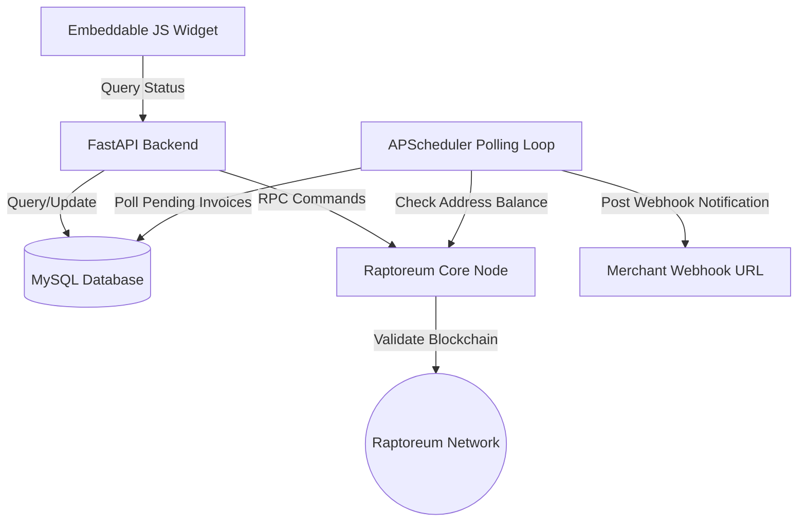

# System Architecture (architecture.md)

This document describes the high-level architecture, component structure, and payment flows of RaptoreumPay.

---

## 1. High-Level Overview

RaptoreumPay is a non-custodial payment processor. It does not custody merchant funds; rather, it monitors the blockchain for payments sent to unique, single-use addresses generated directly from the merchant's Raptoreum Core wallet. Once a payment is detected with sufficient funds, the processor alerts the merchant via a secure webhook, and the funds remain securely in the merchant's private wallet.



---

## 2. Core Components

The codebase is organized into modular Python files under the `app` directory:

1. **`app/main.py`**: The application entry point. It initializes FastAPI, mounts the CORS middleware (allowing widget embeds from other domains), registers static assets, mounts routers, and boots up the background polling scheduler.
2. **`app/config.py`**: Manages environment variables and configurations using `pydantic-settings`. Loads parameters for RPC connection, MySQL database credentials, administrator secrets, and base URLs.
3. **`app/database.py`**: Creates the SQLAlchemy database engine connecting to MySQL via PyMySQL. Configures connection pool settings (`pool_pre_ping=True`, `pool_recycle=3600`) to maintain persistent database connections.
4. **`app/models.py`**: Defines the database schema:
   - **`Merchant`**: Tracks registered merchant emails, active statuses, and secret API keys.
   - **`Invoice`**: Tracks generated checkout sessions. Records the unique RTM address, target RTM amount, approximate USD value, order ID reference, webhook URL, paid amount, creation timestamp, expiry timestamp, transaction ID, and current status (`pending`, `paid`, `expired`, `underpaid`).
5. **`app/rpc_client.py`**: Integrates with the Raptoreum Core daemon using `bitcoinrpc.authproxy`. Responsible for generating new deposit addresses (`getnewaddress`) and checking received amounts (`getreceivedbyaddress`).
6. **`app/services/polling.py`**: Manages the background processing engine using `BackgroundScheduler`. Every 30 seconds, it queries MySQL for all `pending` invoices, checks their corresponding wallet addresses on the Raptoreum node, registers payments, fires off webhooks, and marks expired records.
7. **`app/services/price.py`**: Periodically fetches real-time RTM market pricing in USD from the CoinGecko public API.
8. **`static/widget.js`**: Client-side widget that renders a payment card containing order details, address string, copy tools, countdown timers, and an automatically generated QR code. Polling is done in the background to automatically transition the client's screen on payment success.

---

## 3. Detailed Payment Lifecycle

The sequence of a typical payment transaction is detailed below:

```
[Customer]             [Widget]            [FastAPI Backend]         [RTM Core Node]        [Merchant Server]
    |                      |                       |                        |                       |
    |-- Click Checkout --->|                       |                        |                       |
    |                      |-- POST /create ------>|                                                |
    |                      |   (API Key & USD)     |-- getnewaddress ------>|                       |
    |                      |                       |<-- [Unique Address] ---|                       |
    |                      |                       |                                                |
    |                      |                       |-- Save Invoice to DB -->|                      |
    |                      |<-- [Invoice ID/Addr] -|                                                |
    |                      |                                                                        |
    |-- Scan QR Code ----->|                                                                        |
    |-- Send RTM Payment -------------------------------------------------->|                       |
    |                      |                                                |                       |
    |                      |                                [30s Polling Loop]                      |
    |                      |                       |--- getreceivedbyaddress() ---->|               |
    |                      |                       |<-- [Received Amount] ----------|               |
    |                      |                       |                                                |
    |                      |                       |-- Mark Invoice Paid in DB -->|                 |
    |                      |                       |                                                |
    |                      |                       |-- Trigger webhook payload -------------------->|
    |                      |                       |                                                |
    |                      |<-- status: paid ------|                                                |
    |<-- Display Success --|                                                                        |
```

### 1. Invoice Initialization
The merchant's application server triggers an API request to create an invoice. The request contains the API Key, order reference, and amount in USD or RTM.
- The backend verifies the API key, queries the RTM price (if USD is requested), and requests a new unique receiving address from the Raptoreum Core wallet.
- The invoice is saved in the MySQL database as `pending` with a 45-minute expiration time.

### 2. Widget Rendering & Client Polling
The JavaScript widget dynamically fetches the invoice status from the backend, renders the QR code (containing `raptoreum:<address>?amount=<amount>`), and displays a progress bar countdown. It polls the server every 15 seconds.

### 3. Payment Detection (Server-side)
A background task polls the Raptoreum node via RPC every 30 seconds for all pending invoice addresses.
- If the node reports received funds matching the invoice amount (within a 2% rounding tolerance), the invoice is marked as `paid` with the current timestamp and transaction ID.
- An asynchronous HTTP POST webhook is dispatched immediately to the merchant's endpoint.

### 4. Client Notification
On its next status poll, the widget detects the `paid` status, plays a success state, stops polling, and displays confirmation to the customer.
