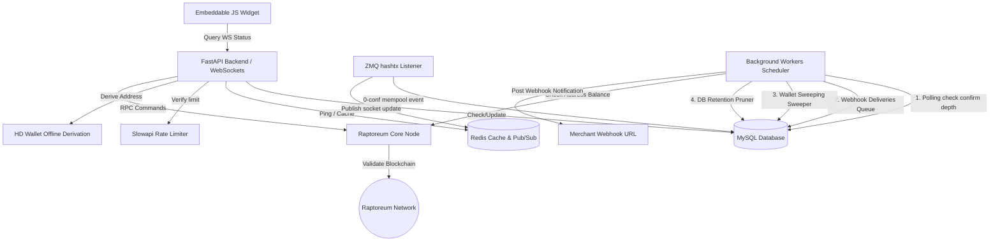

# System Architecture (architecture.md)

This document describes the high-level architecture, component structure, and payment flows of RaptoreumPay.

---

## 1. High-Level Overview

RaptoreumPay is a high-performance, non-custodial payment processor. It does not custody merchant funds; rather, it monitors the blockchain for payments sent to unique, single-use addresses generated either directly from the merchant's Raptoreum Core wallet or derived offline via an Account Extended Public Key (`xpub`). 

Once a payment is detected, the processor updates states, broadcasts real-time alerts to the customer checkout widget via WebSockets, and queue-delivers a secure, signed webhook payload to the merchant's server.



---

## 2. Core Components

The codebase is organized into modular Python files under the `app` directory:

1. **`app/main.py`**: The application entry point. It initializes FastAPI using the modern `lifespan` context manager, mounts CORS middleware dynamically loaded from configured allowed origins, registers the `slowapi` rate limiter, mounts routers, implements the `/api/health` check system, and initializes structured JSON logging on startup.
2. **`app/config.py`**: Manages environment variables and configurations using `pydantic-settings`. Loads parameters for RPC connection, MySQL credentials, Redis connectivity, rate limits, confirmation block depths, sweeping thresholds, the dynamic `cors_allow_origins` list, default fiat billing currency, and structured logging mode.
3. **`app/database.py`**: Creates the SQLAlchemy database engine connecting to MySQL via PyMySQL with connection pool recycling.
4. **`app/logging_config.py`**: Configures a lightweight, zero-dependency structured `JSONFormatter` subclassing `logging.Formatter` to stream console logs as single-line JSON strings suitable for production log aggregators.
5. **`app/models.py`**: Defines the database schema:
   - **`Merchant`**: Tracks emails, API keys, `xpub` (Master Public Key), `next_address_index`, `sweep_address`, `sweep_threshold`, `sweep_cold_address`, and `sweep_split_ratio`.
   - **`Invoice`**: Tracks address, RTM amount, fiat value, status (`pending`, `detected`, `paid`, `expired`, `underpaid`), `is_swept` sweeping status, and payment txid.
   - **`WebhookDelivery`**: Manages the persistent queue. Stores url, payload, status (`pending`, `sent`, `failed`, `dlq`), retry attempts, next attempt schedule, and last errors.
6. **`app/rpc_client.py`**: Integrates with the core daemon via JSON-RPC. Handles address validation (`validateaddress`), balance checking (`getbalance`), address querying (`getreceivedbyaddress`), and UTXO sweeps (`sendtoaddress` with subtract-fees and smart fee parameters).
7. **`app/redis_client.py`**: Configures Redis client instances for caching and pub/sub socket broadcasts (falls back to memory if Redis is disabled).
8. **`app/limiter.py`**: Configures API rate limit limits based on slowapi.
9. **`app/services/hd_wallet.py`**: Offline HD wallet address generator. Derives mainnet legacy P2PKH addresses from `xpub` structures using the `bip-utils` library.
10. **`app/services/polling.py`**: Main scheduler orchestrating:
   - **Invoice Confirmation Polling**: Confirms payments when they meet confirmation depth.
   - **Webhook Deliveries Queue**: Dispatches POSTs with exponential backoff and routes failures to a Dead Letter Queue (DLQ).
   - **Wallet Sweeping**: Sweeps paid funds, supporting splitting between the hot wallet `sweep_address` and cold-storage `sweep_cold_address` according to the configured `sweep_split_ratio`.
   - **Database Pruning**: Deletes expired invoices (>30 days) and sent webhooks (>7 days).
11. **`app/services/price.py`**: Price oracle aggregator. Fetches rates dynamically for generic fiat currencies (USD, EUR, GBP) from CoinGecko, falling back to CoinEx ticker if CoinGecko is offline, and caching results in Redis. Implements a resilient memory cache fallback if Redis is enabled but goes offline.
12. **`app/services/zmq_listener.py`**: Subscribes to the node's `hashtx` ZeroMQ socket to capture mempool broadcasts instantly. Distributes incoming transaction check tasks to a bounded `ThreadPoolExecutor` to prevent thread and process exhaustion under high mempool loads.
13. **`static/widget.js`**: Scoped checkout UI. Attempts a WebSocket connection for real-time transitions (0-conf detected / paid), automatically falling back to HTTP REST polling if the socket drops.
14. **`sdk/raptoreumpay.py`**: Developer Python SDK. Exposes a simple `RaptoreumPayClient` for invoice creation, status checking, and HMAC webhook signature validation without external dependencies.
15. **`sdk/raptoreumpay.php`**: Developer PHP SDK. Exposes a `RaptoreumPayClient` class with cURL integration and PHP `hash_equals()` replay-proof signature verification.
16. **`sdk/raptoreumpay.js`**: Developer Node.js SDK. Exposes a `RaptoreumPayClient` class using native `fetch` and crypto-based timing-safe signature checks.

---

## 3. Detailed Payment Lifecycle

The sequence of a typical payment transaction is detailed below:

```
[Customer]             [Widget]            [FastAPI Backend]         [RTM Core Node]        [Merchant Server]
    |                      |                       |                        |                       |
    |-- Click Checkout --->|                       |                        |                       |
    |                      |-- POST /create ------>|                                                |
    |                      |   (API Key & USD)     |-- Derive address (offline)                     |
    |                      |                       |   OR call getnewaddress RPC ->|                |
    |                      |                       |<-- [Address] -----------------|                |
    |                      |                       |                                                |
    |                      |                       |-- Save Invoice to DB --------->|                |
    |                      |<-- [Invoice ID/Addr] -|                                                |
    |                      |                                                                        |
    |                      |-- Connect WebSocket ->|                                                |
    |                      |   (WS Handshake /ws)  |                                                |
    |                      |<-- Connected ---------|                                                |
    |                      |                                                                        |
    |-- Scan QR Code ----->|                                                                        |
    |-- Send RTM Payment -------------------------------------------------->|                       |
    |                      |                                                |                       |
    |                      |                                  [ZMQ Event]   |                       |
    |                      |                       |<-- hashtx (0-conf) ----|                       |
    |                      |                       |                                                |
    |                      |                       |-- Mark status: detected ------>|                       |
    |                      |                       |-- Broadcast 'detected' to WS ->|                       |
    |                      |<-- status: detected --|                                                |
    |                      |                                                                        |
    |                      |                               [Background Polling Loop]                |
    |                      |                       |-- getreceivedbyaddress(minconf) ->|            |
    |                      |                       |<-- [Confirmed balance] -----------|            |
    |                      |                       |                                                |
    |                      |                       |-- Mark Invoice status: paid -->|               |
    |                      |                       |-- Queue Webhook Delivery ----->|               |
    |                      |                       |-- Broadcast 'paid' to WS ----->|               |
    |                      |<-- status: paid ------|                                                |
    |                      |                                                                        |
    |                      |                               [Background Webhook Queue]               |
    |                      |                       |===============================================>|
    |                      |                       |                 POST webhook (HMAC Signed)     |
    |                      |                       |<===============================================|
    |                      |                       |                 HTTP 200 OK                    |
    |<-- Display Success --|                                                                        |
```

### 1. Invoice Initialization
The checkout widget or merchant's server issues a `POST /api/payment/create` request.
- If the merchant has configured an `xpub` extended public key, the address is derived completely **offline** (watch-only). Otherwise, the backend requests a new receiving address from the core wallet node via JSON-RPC.
- The invoice is stored in the MySQL database as `pending` with a 45-minute TTL.

### 2. WS Handshake & Mempool Detection
The client widget establishes a persistent connection to the WebSockets gateway.
- As soon as the customer broadcasts their transaction to the blockchain, the node publishes it via ZMQ to the `zmq_listener` thread.
- The invoice status is updated in the database to `"detected"` (0-conf) and the socket instantly pushes this state to the client, displaying "Payment detected, awaiting confirmation" without any REST polling overhead.

### 3. Confirmation Depth Verification
The background polling loop checks all `"detected"` invoices at the target block confirmation depth (`min_confirmations` setting, e.g., 1 confirmation).
- Once the balance is verified as confirmed by the blockchain node, the status is updated to `"paid"`, `paid_at` timestamp is written, and the WebSocket gateway broadcasts `"paid"`.
- Instead of triggering HTTP requests synchronously, a secure `WebhookDelivery` log is created in the database queue.

### 4. Resilient Webhook Dispatch
The database-backed webhook queue processor attempts to POST the signed HMAC-SHA256 payload.
- If the merchant server is offline, the task schedules a retry with exponential backoffs. If all 5 attempts fail, the delivery is flagged as `"dlq"` (Dead Letter Queue) so it can be re-sent manually.
- The customer widget receives the `"paid"` WS frame, displays a checkmark, and routes the user to the transaction receipt page.

---

## 4. Advanced Wallet Sweeping & Cold-Storage Split Sweeps

To protect operational funds, RaptoreumPay features an automated background wallet sweeping worker that periodically aggregates UTXOs from one-time payment addresses to a merchant's designated sweep addresses.

Starting in Phase 8, merchants can configure a `sweep_cold_address` and a `sweep_split_ratio` (a decimal between 0.0 and 1.0, e.g. `0.7` for 70%). When sweeping paid invoice balances:
- The system splits the swept funds according to the ratio.
- The cold storage portion (e.g. 70%) is routed to the merchant's offline `sweep_cold_address`.
- The remaining portion (e.g. 30%) is routed to the merchant's standard operational `sweep_address` (hot wallet).
- If no cold address or split ratio is configured, 100% of the funds are routed to the standard `sweep_address`.

This split is executed as a single batch transaction or consecutive payments with subtraction of fees enabled, minimizing network transaction costs while ensuring immediate cold storage security.
